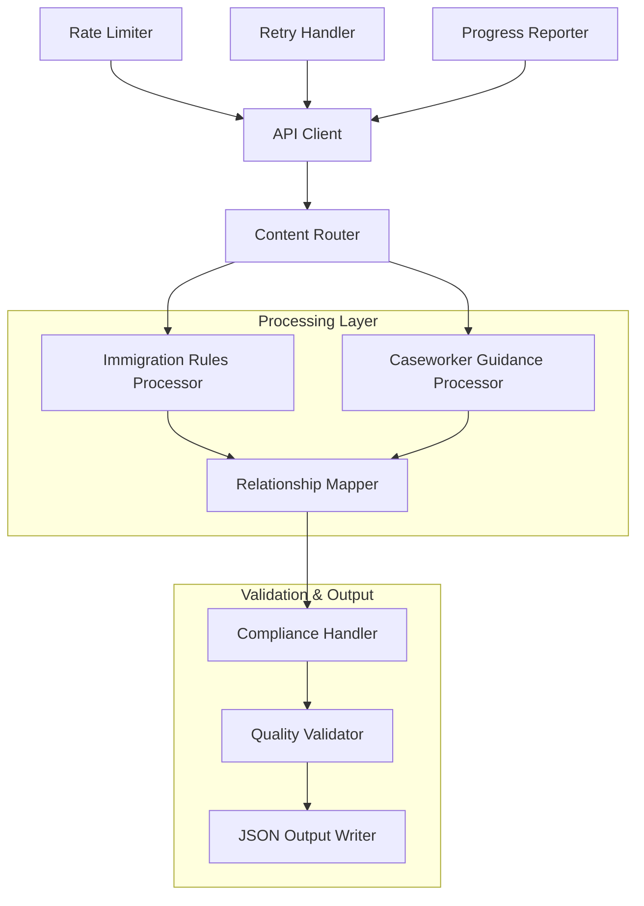

# Design Document: UK Immigration Data Extraction Pipeline

## Overview

The UK Immigration Data Extraction Pipeline is a clean, minimal system that extracts raw content from 690 GOV.UK immigration endpoints and transforms it into structured JSON format. The pipeline handles two distinct content types: Immigration Rules (legislative HTML) and Caseworker Guidance (document collections with attachments), while ensuring full compliance with Open Government Licence v3.0 requirements.

The system follows a simple pipeline architecture with single-responsibility components that process raw API responses, extract content while preserving hierarchical relationships, and output clean JSON Lines format data with proper attribution and licensing metadata.

## Architecture



### Architecture Principles

1. **Single Responsibility**: Each component handles one specific aspect of the extraction process
2. **Clean Separation**: Content processing is separated from compliance and quality concerns
3. **Fail-Safe Processing**: Individual endpoint failures don't stop the overall pipeline
4. **Rate Limit Respect**: Built-in rate limiting ensures API compliance
5. **Raw Data Focus**: No preprocessing, chunking, or embeddings - preserve original structure

## Components and Interfaces

### API Client
**Purpose**: Manages all interactions with the GOV.UK Content API while respecting rate limits and handling retries.

**Key Methods**:
```python
class APIClient:
    def fetch_content(self, endpoint_path: str) -> ContentResponse
    def get_batch_content(self, endpoint_paths: List[str]) -> Iterator[ContentResponse]
    def check_rate_limit(self) -> None
```

**Responsibilities**:
- Enforce 2 requests per second rate limit
- Implement exponential backoff retry logic
- Handle API errors and timeouts
- Provide progress reporting for long-running operations

### Content Router
**Purpose**: Determines the appropriate processor based on document type and routes content accordingly.

**Key Methods**:
```python
class ContentRouter:
    def route_content(self, content_response: ContentResponse) -> ProcessorType
    def is_immigration_rules(self, document_type: str) -> bool
    def is_caseworker_guidance(self, document_type: str) -> bool
```

**Document Type Mapping**:
- `manual_section` → Immigration Rules Processor
- `publication` → Caseworker Guidance Processor

### Immigration Rules Processor
**Purpose**: Extracts content from legislative HTML documents while preserving rule numbering and hierarchical structure.

**Key Methods**:
```python
class ImmigrationRulesProcessor:
    def extract_content(self, html_body: str) -> ProcessedContent
    def preserve_legislative_structure(self, html: BeautifulSoup) -> StructuredContent
    def extract_cross_references(self, content: StructuredContent) -> List[Reference]
```

**Processing Logic**:
- Parse `details.body` HTML content
- Preserve `<ol class="legislative-list">` structure
- Extract and maintain cross-reference links
- Normalize formatting while preserving semantic meaning

### Caseworker Guidance Processor  
**Purpose**: Handles document collections and extracts content from both HTML and PDF attachments.

**Key Methods**:
```python
class CaseworkerGuidanceProcessor:
    def extract_attachments(self, attachments: List[Attachment]) -> List[ProcessedContent]
    def process_pdf_attachment(self, pdf_content: bytes) -> ProcessedContent
    def process_html_attachment(self, html_content: str) -> ProcessedContent
    def preserve_table_structure(self, html: BeautifulSoup) -> TableStructure
```

**Processing Logic**:
- Extract content from `details.attachments[]` array
- Convert PDF content to structured text with hierarchy preservation
- Process HTML attachments while maintaining table relationships
- Preserve file metadata (sizes, types) for all attachments

### Relationship Mapper
**Purpose**: Identifies and preserves hierarchical relationships and cross-references between documents.

**Key Methods**:
```python
class RelationshipMapper:
    def map_document_hierarchy(self, content: ProcessedContent) -> DocumentRelationships
    def extract_parent_child_links(self, content_links: Dict) -> List[Relationship]
    def normalize_cross_references(self, references: List[Reference]) -> List[NormalizedReference]
```

**Relationship Types**:
- Parent-child document relationships
- Cross-references between rules and sections
- Collection membership relationships
- Attachment relationships

### Compliance Handler
**Purpose**: Ensures all extracted data includes proper OGL v3.0 licensing and attribution information.

**Key Methods**:
```python
class ComplianceHandler:
    def add_ogl_licensing(self, content: ProcessedContent) -> LicensedContent
    def generate_attribution(self, source_url: str, access_date: datetime) -> Attribution
    def validate_crown_copyright(self, content: ProcessedContent) -> bool
```

**Compliance Requirements**:
- Add OGL v3.0 licensing information to all outputs
- Include complete source attribution (URLs, access dates)
- Maintain Crown Copyright notices
- Add terms of use in output headers

### Quality Validator
**Purpose**: Validates extracted content for completeness, encoding, and structural integrity.

**Key Methods**:
```python
class QualityValidator:
    def validate_encoding(self, text_content: str) -> ValidationResult
    def check_content_completeness(self, processed_content: ProcessedContent) -> bool
    def validate_success_rate(self, results: List[ProcessingResult]) -> ValidationResult
```

**Validation Checks**:
- Text encoding and readability verification
- Content structure integrity checks  
- Success rate monitoring (minimum 95%)
- Error threshold monitoring (halt if >10% failures)

### JSON Output Writer
**Purpose**: Serializes processed content into clean JSON Lines format with standardized schema.

**Key Methods**:
```python
class JSONOutputWriter:
    def write_jsonl_output(self, content_batch: List[LicensedContent]) -> None
    def format_output_record(self, content: LicensedContent) -> OutputRecord
    def write_licensing_headers(self, output_file: TextIO) -> None
```

## Data Models

### Core Data Structures

```python
@dataclass
class ContentResponse:
    content_id: str
    base_path: str
    title: str
    document_type: str
    details: Dict[str, Any]
    links: Dict[str, Any]
    public_updated_at: str
    
@dataclass  
class ProcessedContent:
    content_id: str
    title: str
    content_text: str
    document_type: str
    structure: ContentStructure
    relationships: List[Relationship]
    metadata: ContentMetadata
    
@dataclass
class LicensedContent:
    processed_content: ProcessedContent
    licensing_info: OGLLicensing
    attribution: Attribution
    compliance_metadata: ComplianceMetadata

@dataclass
class OutputRecord:
    content_id: str
    title: str
    content_text: str
    document_type: str
    source_url: str
    extracted_at: str
    licensing_info: Dict[str, str]
    metadata: Dict[str, Any]
```

### Relationship Models

```python
@dataclass
class Relationship:
    source_id: str
    target_id: str
    relationship_type: str  # "parent_child", "cross_reference", "attachment"
    metadata: Dict[str, Any]

@dataclass  
class Reference:
    source_location: str
    target_path: str
    reference_text: str
    reference_type: str
```

### Compliance Models

```python
@dataclass
class OGLLicensing:
    licence_name: str = "Open Government Licence v3.0"
    licence_url: str = "https://www.nationalarchives.gov.uk/doc/open-government-licence/version/3/"
    attribution_statement: str
    
@dataclass
class Attribution:
    source_organisation: str = "HM Government"
    source_url: str
    access_date: str
    copyright_notice: str
```

## Correctness Properties

*A property is a characteristic or behavior that should hold true across all valid executions of a system-essentially, a formal statement about what the system should do. Properties serve as the bridge between human-readable specifications and machine-verifiable correctness guarantees.*

### Property 1: Content Extraction Completeness
*For any* valid GOV.UK content response, the Document_Processor SHALL successfully extract and preserve the primary content from the appropriate source field (`details.body` for Immigration Rules, `details.attachments[]` for Caseworker Guidance).

**Validates: Requirements 1.1, 1.2**

### Property 2: Structure Preservation
*For any* HTML content with structural elements (headers, lists, tables, cross-references), the extraction process SHALL preserve these structural relationships in the output without loss of semantic meaning.

**Validates: Requirements 1.3, 2.1, 2.3**

### Property 3: Document Type Processing
*For any* document with type `manual_section` or `publication`, the Content Router SHALL direct it to the appropriate processor and the processor SHALL handle the document according to its type-specific requirements.

**Validates: Requirements 1.5, 2.4**

### Property 4: Cross-Reference Preservation  
*For any* document containing cross-references or hierarchical relationships, the Relationship Mapper SHALL identify and preserve these connections in the output data structure.

**Validates: Requirements 2.2, 2.4**

### Property 5: OGL v3.0 Compliance
*For any* extracted content item, the Compliance Handler SHALL include proper OGL v3.0 licensing information, complete source attribution, and Crown Copyright notices as specified by the licence terms.

**Validates: Requirements 3.1, 3.2, 3.3, 3.4**

### Property 6: Output Format Consistency
*For any* processed document, the JSON Output Writer SHALL generate a record in JSON Lines format containing all required standardized fields (content_id, title, content_text, document_type, source_url, extracted_at, licensing_info).

**Validates: Requirements 5.1, 5.2**

### Property 7: Metadata Preservation
*For any* document with metadata (publication dates, identifiers, attachment information), the Metadata_Enricher SHALL preserve this information in the output without loss or corruption.

**Validates: Requirements 5.3, 5.5**

### Property 8: Structure Integrity
*For any* document, the extraction pipeline SHALL maintain the original document structure without introducing artificial segmentation, chunking, or unauthorized modifications to the content organization.

**Validates: Requirements 5.4**

### Property 9: Encoding Validation
*For any* text content processed by the pipeline, the Quality_Validator SHALL verify proper encoding and readability, ensuring no character corruption or encoding errors in the output.

**Validates: Requirements 4.1**

### Property 10: Fault Tolerance
*For any* processing batch containing some failed endpoints, the pipeline SHALL continue processing the remaining endpoints and maintain operation until completion or critical failure threshold.

**Validates: Requirements 4.2, 4.5**

### Property 11: Rate Limit Compliance
*For any* sequence of API requests, the API Client SHALL enforce the 2 requests per second limit and implement proper exponential backoff retry logic for failed requests.

**Validates: Requirements 6.1, 4.4, 6.2**

### Property 12: Configuration Flexibility
*For any* valid environment variable configuration for rate limits and retry behavior, the pipeline SHALL apply these settings correctly and operate according to the specified parameters.

**Validates: Requirements 6.5**

## Error Handling

### Error Classification

1. **Transient Errors**: Network timeouts, temporary API unavailability
   - **Strategy**: Exponential backoff retry (max 3 attempts)
   - **Escalation**: Continue processing other endpoints

2. **Content Errors**: Malformed HTML, corrupted PDF attachments  
   - **Strategy**: Log detailed error, skip individual document
   - **Escalation**: Continue processing if <10% failure rate

3. **System Errors**: Memory exhaustion, disk space, configuration issues
   - **Strategy**: Immediate halt with detailed error reporting
   - **Escalation**: Manual intervention required

4. **Rate Limit Errors**: API rate limit exceeded
   - **Strategy**: Implement exponential backoff, respect limits
   - **Escalation**: Continue with adjusted rate limiting

### Error Recovery Mechanisms

```python
@dataclass
class ErrorResult:
    endpoint_path: str
    error_type: str
    error_message: str
    retry_count: int
    timestamp: str

class ErrorHandler:
    def handle_transient_error(self, error: Exception, retry_count: int) -> bool
    def handle_content_error(self, content_id: str, error: Exception) -> None
    def check_failure_threshold(self, results: List[ProcessingResult]) -> bool
    def generate_error_report(self, errors: List[ErrorResult]) -> ErrorReport
```

## Testing Strategy

### Dual Testing Approach

The testing strategy combines property-based testing for universal correctness properties with integration tests for system-level behavior and external service interactions.

### Property-Based Testing

**Library**: Hypothesis (Python) with minimum 100 iterations per property
**Focus**: Universal properties that hold across all valid inputs

**Test Configuration**:
- Each property test references its design document property
- Tag format: **Feature: uk-immigration-data-extraction-pipeline, Property N: [Property Text]**
- Generate diverse input data including edge cases (empty content, special characters, large documents)
- Mock external API calls to test logic separately from integration

**Property Test Coverage**:
- Content extraction across various document structures
- Structure preservation with different HTML/PDF formats  
- Compliance metadata generation for all content types
- Error handling and retry logic with simulated failures
- Rate limiting behavior with various request patterns

### Integration Testing

**Focus**: End-to-end system behavior and external service integration

**Integration Test Coverage**:
- Full pipeline execution with representative endpoint samples
- GOV.UK Content API integration with actual API calls
- Performance validation under realistic workloads
- Success rate verification (minimum 95% of endpoints)
- System resource usage and memory management

### Unit Testing

**Focus**: Individual component behavior and edge cases

**Unit Test Coverage**:
- Component interface contracts and error conditions
- Configuration handling with various environment settings
- File I/O operations and JSON serialization
- PDF processing with various document formats
- HTML parsing with malformed or edge case content

### Test Data Strategy

- **Generated Data**: Property tests use Hypothesis to generate diverse document structures
- **Representative Samples**: Integration tests use actual GOV.UK endpoint responses
- **Edge Cases**: Unit tests cover boundary conditions and error scenarios
- **Compliance Validation**: All tests verify OGL v3.0 compliance requirements